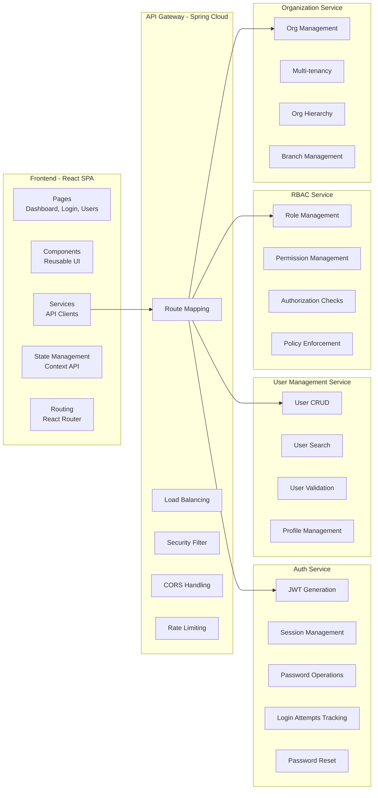
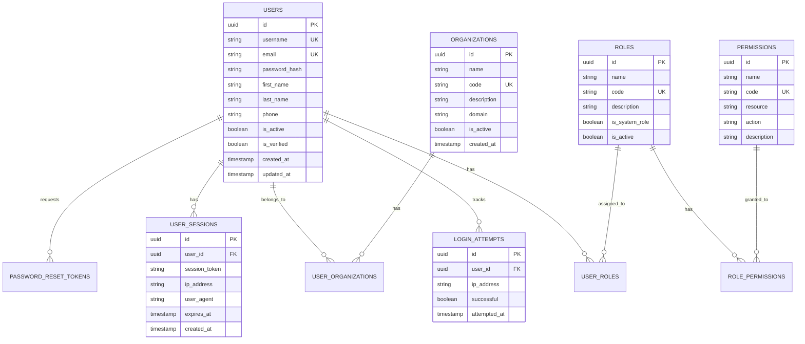
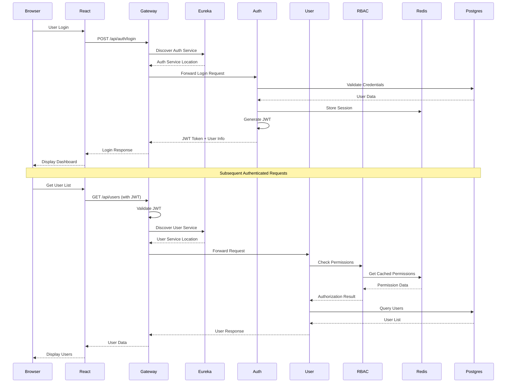
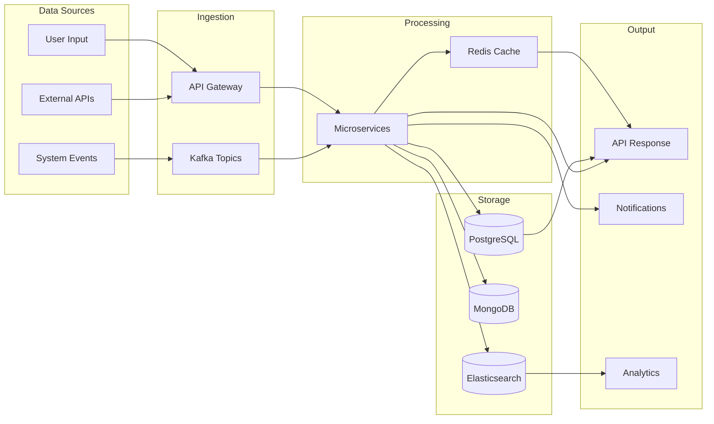
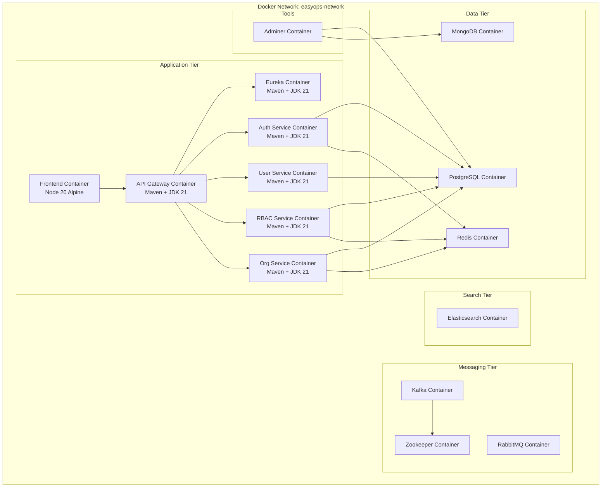
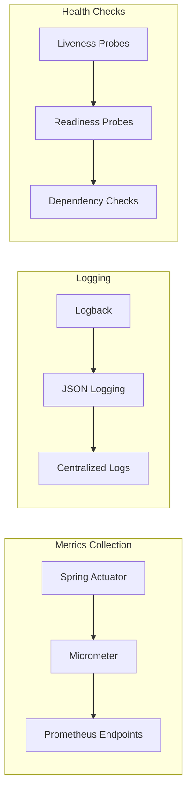
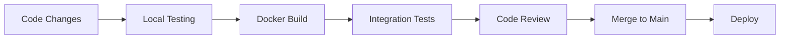

# EasyOps ERP System Architecture

## System Overview

EasyOps ERP is a microservices-based Enterprise Resource Planning system built with Spring Boot (backend) and React (frontend), designed for multi-tenancy and scalability.

---

## High-Level Architecture Diagram

```mermaid
graph TB
    subgraph "Client Layer"
        Browser[Web Browser]
    end

    subgraph "Frontend Layer"
        React[React Application<br/>Port: 3000<br/>Vite + TypeScript]
    end

    subgraph "API Gateway Layer"
        Gateway[API Gateway<br/>Port: 8081<br/>Spring Cloud Gateway<br/>Reactive WebFlux]
    end

    subgraph "Service Discovery"
        Eureka[Eureka Server<br/>Port: 8761<br/>Netflix Eureka]
    end

    subgraph "Microservices Layer"
        AuthService[Auth Service<br/>Port: 8083<br/>JWT + Sessions]
        UserMgmt[User Management<br/>Port: 8082<br/>User CRUD]
        RBAC[RBAC Service<br/>Port: 8084<br/>Roles & Permissions]
        OrgService[Organization Service<br/>Port: 8085<br/>Multi-tenancy]
    end

    subgraph "Database Layer"
        Postgres[(PostgreSQL<br/>Port: 5432<br/>Main Database)]
        MongoDB[(MongoDB<br/>Port: 27017<br/>Document Store)]
        Redis[(Redis<br/>Port: 6379<br/>Cache & Sessions)]
    end

    subgraph "Message Queue Layer"
        Kafka[Kafka<br/>Port: 9092<br/>Event Streaming]
        RabbitMQ[RabbitMQ<br/>Port: 5672, 15672<br/>Message Broker]
        Zookeeper[Zookeeper<br/>Port: 2181<br/>Kafka Coordinator]
    end

    subgraph "Search & Analytics"
        Elastic[Elasticsearch<br/>Port: 9200<br/>Full-text Search]
    end

    subgraph "Development Tools"
        Adminer[Adminer<br/>Port: 8080<br/>Database UI]
    end

    Browser --> React
    React --> Gateway
    Gateway --> Eureka
    Gateway --> AuthService
    Gateway --> UserMgmt
    Gateway --> RBAC
    Gateway --> OrgService
    
    AuthService --> Eureka
    UserMgmt --> Eureka
    RBAC --> Eureka
    OrgService --> Eureka
    
    AuthService --> Postgres
    AuthService --> Redis
    UserMgmt --> Postgres
    RBAC --> Postgres
    RBAC --> Redis
    OrgService --> Postgres
    OrgService --> Redis
    
    AuthService -.-> Kafka
    UserMgmt -.-> Kafka
    RBAC -.-> Kafka
    OrgService -.-> Kafka
    
    AuthService -.-> RabbitMQ
    UserMgmt -.-> RabbitMQ
    
    Kafka --> Zookeeper
    
    Adminer --> Postgres
    Adminer --> MongoDB
    
    style Browser fill:#e1f5ff
    style React fill:#61dafb
    style Gateway fill:#6db33f
    style Eureka fill:#ff6b6b
    style AuthService fill:#6db33f
    style UserMgmt fill:#6db33f
    style RBAC fill:#6db33f
    style OrgService fill:#6db33f
    style Postgres fill:#336791
    style MongoDB fill:#47a248
    style Redis fill:#dc382d
    style Kafka fill:#231f20
    style RabbitMQ fill:#ff6600
    style Elastic fill:#005571
```



---

## Detailed Component Architecture



---

## Database Schema Architecture



---

## Service Communication Patterns



---

## Technology Stack

### Frontend
- **Framework**: React 18
- **Language**: TypeScript
- **Build Tool**: Vite
- **UI**: Modern CSS with responsive design
- **State Management**: React Context API
- **HTTP Client**: Axios
- **Routing**: React Router

### Backend Microservices
- **Framework**: Spring Boot 3.3.3
- **Language**: Java 21
- **Service Discovery**: Netflix Eureka
- **API Gateway**: Spring Cloud Gateway (Reactive)
- **Security**: Spring Security + JWT
- **Data Access**: Spring Data JPA
- **Validation**: Jakarta Bean Validation
- **Caching**: Spring Cache with Redis

### Databases
- **PostgreSQL 17**: Primary relational database
  - Schemas: users, auth, rbac, admin, system, audit
- **MongoDB 7**: Document storage for unstructured data
- **Redis 7**: Caching and session management

### Message Queues
- **Apache Kafka**: Event streaming and async communication
- **RabbitMQ**: Traditional message brokering

### Search & Analytics
- **Elasticsearch 8.11**: Full-text search and analytics

### DevOps & Tools
- **Docker**: Containerization
- **Docker Compose**: Local orchestration
- **Adminer**: Database management UI
- **Maven**: Build automation

---

## Security Architecture

```mermaid
graph TB
    subgraph "Security Layers"
        L1[HTTPS/TLS]
        L2[CORS Policy]
        L3[API Gateway Security]
        L4[JWT Validation]
        L5[RBAC Authorization]
        L6[Data Encryption]
    end

    subgraph "Authentication Flow"
        A1[Login Request]
        A2[Credential Validation]
        A3[JWT Generation]
        A4[Session Creation]
        A5[Response with Token]
    end

    subgraph "Authorization Flow"
        B1[Extract JWT]
        B2[Validate Token]
        B3[Get User Permissions]
        B4[Check Resource Access]
        B5[Allow/Deny Request]
    end

    L1 --> L2 --> L3 --> L4 --> L5 --> L6
    A1 --> A2 --> A3 --> A4 --> A5
    B1 --> B2 --> B3 --> B4 --> B5
```



### Security Features
- **JWT Authentication**: Stateless token-based auth
- **Session Management**: Redis-backed sessions
- **Password Security**: BCrypt hashing
- **Login Attempt Tracking**: Brute force protection
- **Password Reset**: Secure token-based reset
- **RBAC**: Fine-grained permission control
- **CORS**: Configurable cross-origin policies
- **Rate Limiting**: API throttling (planned)

---

## Data Flow Architecture



---

## Deployment Architecture



### Container Details

| Service | Base Image | Exposed Port | Health Check |
|---------|-----------|--------------|--------------|
| Frontend | node:20-alpine | 3000 | HTTP on / |
| API Gateway | maven:3.9-temurin-21 | 8081 | Actuator /health |
| Eureka | maven:3.9-temurin-21 | 8761 | Actuator /health |
| Auth Service | maven:3.9-temurin-21 | 8083 | Actuator /health |
| User Management | maven:3.9-temurin-21 | 8082 | Actuator /health |
| RBAC Service | maven:3.9-temurin-21 | 8084 | Actuator /health |
| Org Service | maven:3.9-temurin-21 | 8085 | Actuator /health |
| PostgreSQL | postgres:17 | 5432 | pg_isready |
| MongoDB | mongo:7 | 27017 | mongosh ping |
| Redis | redis:7-alpine | 6379 | redis-cli ping |
| Kafka | confluentinc/cp-kafka:7.3.3 | 9092 | kafka-topics list |
| Zookeeper | confluentinc/cp-zookeeper | 2181 | nc -z |
| RabbitMQ | rabbitmq:3-management | 5672, 15672 | rabbitmq-diagnostics |
| Elasticsearch | elasticsearch:8.11.0 | 9200 | curl /_cluster/health |
| Adminer | adminer | 8080 | N/A |

---

## Scalability & Performance

### Horizontal Scaling
- **Stateless Services**: All microservices are stateless
- **Service Discovery**: Eureka enables dynamic scaling
- **Load Balancing**: Client-side load balancing via Ribbon
- **Session Externalization**: Redis for distributed sessions

### Caching Strategy
- **L1 Cache**: Application-level caching
- **L2 Cache**: Redis distributed cache
- **Cache Patterns**: 
  - Cache-aside for user data
  - Write-through for sessions
  - TTL-based expiration

### Performance Optimizations
- **Database Connection Pooling**: HikariCP
- **Async Processing**: Kafka for event-driven operations
- **Reactive Programming**: WebFlux in API Gateway
- **Index Optimization**: Proper database indexes
- **Query Optimization**: JPA query optimization

---

## Monitoring & Observability



### Monitoring Capabilities
- **Health Endpoints**: `/actuator/health` on all services
- **Metrics**: CPU, memory, request rates, response times
- **Tracing**: Distributed tracing ready (Sleuth/Zipkin integration planned)
- **Logging**: Structured JSON logging
- **Alerts**: Health check failures trigger restarts

---

## Future Enhancements

### Planned Modules
1. **Accounting Module**: Complete accounting functionality
2. **Inventory Module**: Warehouse and inventory management
3. **Sales Module**: Sales order processing
4. **Purchase Module**: Procurement management
5. **Manufacturing Module**: Production planning
6. **HR Module**: Human resources management
7. **CRM Module**: Customer relationship management

### Infrastructure Enhancements
- **Service Mesh**: Istio for advanced traffic management
- **CI/CD**: Jenkins/GitLab CI pipelines
- **Monitoring**: Prometheus + Grafana dashboards
- **Tracing**: Zipkin/Jaeger integration
- **API Documentation**: OpenAPI/Swagger
- **Testing**: Increased test coverage with TestContainers

---

## Quick Start

See [DOCKER_START.md](DOCKER_START.md) for complete Docker setup instructions.

```bash
# Start all services
cd easyops-erp
docker-compose up -d

# Check status
docker-compose ps

# View logs
docker-compose logs -f

# Access applications
# Frontend: http://localhost:3000
# Eureka: http://localhost:8761
# Adminer: http://localhost:8080
```

---

## Development Workflow



---

## Contact & Support

For architecture questions or system design discussions, please refer to:
- [IMPLEMENTATION.md](IMPLEMENTATION.md) - Implementation details
- [QUICKSTART.md](QUICKSTART.md) - Quick start guide
- [TESTING_GUIDE.md](TESTING_GUIDE.md) - Testing guidelines

---

**Version**: 1.0.0 (Phase 0.2)  
**Last Updated**: October 2025  
**Architecture**: Microservices with Spring Cloud  
**Status**: Active Development

